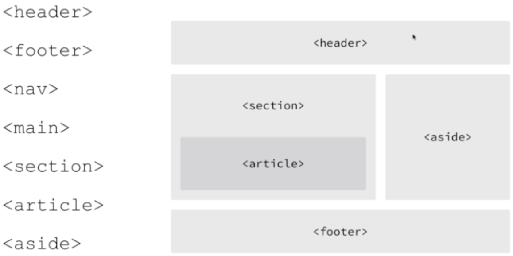
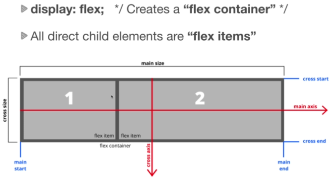

## **Basic Layout**
* The <!DOCTYPE> declaration must be the very first thing in your HTML document, before the <html> tag.

* The <!DOCTYPE> declaration is not an HTML tag; it is an instruction to the web browser about what version of HTML the page is written in.
https://www.w3schools.com/tags/tag_doctype.asp

* `<head>` -> info about the file

> Basic structure
``` html
<!DOCTYPE html>
<html>
    <head>
        <title>My Website</title>
    </head>
    <body>
        <h1>My Website</h1>
    </body>
</html>
```

> Meta data
``` html
<head>
    <meta charset="UTF-8">
    <!-- For responsive site -->
    <meta name="viewport" content="width=device-width, initial-scale=1.0">
    <!-- Browser compatibility -->
    <meta http-equiv="X-UA-Compatible" content="ie=edge">
    <!-- Displayed as description/short summary in search engine -->
    <meta name="description" content="This is my website description">
    <!-- Not so much important nowadays but are tags for seo -->
    <meta name="keywords" content="web development, web design">
    <!-- If don't want site to index/show on search engine -->
    <meta name="robots" content="NOINDEX, NOFOLLOW">
    <!-- Displayed in search engine -->
    <title>Meta Tags</title>

</head>
```

## **Typography**
* `<h1>` -> you want one h1 per page as used by SEO
* `<h1>` -> `<h6>` -> bigger to smaller

* `<strong>` -> to stand out (`<b>`, `<u>`, `<i>` -> old tag has been deprecated with html5)
* `<em>` -> italic
* `<br>` -> line break
* `<hr>` -> horizontal rule (break plus line)

## **Links `<a>`**
> External link
``` html
<a href="http://www.google.com" target="_blank">Click For Google</a>
```

> Internal link - relative path
``` html
<a href="./04_typography.html" target="_blank">Typography</a>
```

## **Images ``**
> Local image
``` html

```
> Remote image
``` html

```

## **List** 
> Unordered list `<ul>`
``` html
<ul>
    <li>Item 1</li>
    <li>Item 2</li>
    <li>Item 3</li>
    ...
</ul>
```
> Ordered list `<ol>`
``` html
<ol type="1"> <!-- List of numerical numbers - default if type no defined -->
    <li>Item 1</li>
    <li>Item 2</li>
    <li>Item 3</li>
    ...
</ol>
  
<ol type="A"> <!-- List of A,B,C,...  -->
    <li>Item 1</li>
    <li>Item 2</li>
    <li>Item 3</li>
    ...
</ol>  

<ol type="A"> <!-- List of a,b,c,...  -->
    <li>Item 1</li>
    <li>Item 2</li>
    <li>Item 3</li>
    ...
</ol> 

<ol type="I"> <!-- List of uppercase roman numerals  -->
    <li>Item 1</li>
    <li>Item 2</li>
    <li>Item 3</li>
    ...
</ol> 

<ol type="i"> <!-- List of lower case roman numerals  -->
    <li>Item 1</li>
    <li>Item 2</li>
    <li>Item 3</li>
    ...
</ol> 
```
> Nested list
``` html
<ol> 
    <li>Item 1</li>
    <li>Item 2
      <ul>
        <li>Nested item 1</li>
        <li>Nested item 2</li>
        <li>Nested item 3</li>
      </ul>
    </li>
    <li>Item 3</li>
    ...
</ol>
```

## **Tables**
``` html
<table>
    <thead>
      <tr>
        <th>First Name</th>
        <th>Last Name</th>
        <th>Email</th>
      </tr>
    </thead>
    <tbody>
      <tr>
        <td>John</td>
        <td>Doe</td>
        <td>doe@gmail.com</td>
      </tr>
      <tr>
        <td>Mary</td>
        <td>Jones</td>
        <td>jones@gmail.com</td>
      </tr>
    </tbody>
</table>
```

## **Forms**
``` html
<form action="process.php"> <!-- backend process -->
    <!-- Input -->
    <div>
        <label for="name">Name</label>
        <!-- for to match the id for html functionality -->
        <input type="text" id="name" name="name" value="John Doe" />
        <!-- Use value for default value -->
        <!-- name attribute is used on the server side -->
    </div>
    <!-- Email -->
    <div>
        <label for="email">Email</label>
        <input
            type="email"
            id="email"
            name="email"
            placeholder="Enter an email"
        />
        <!-- type="email" comes with validation -->
        <!-- Use placeholder for values that goes away when typing -->
    </div>
    <!-- TextArea -->
    <div>
        <label for="message">Message</label>
        <textarea
            name="message"
            id="message"
            cols="30"
            rows="10"
        ></textarea><!-- textarea -->
    </div>
    <!-- Select -->
    <div>
        <label for="sex">Sex</label>
        <select name="sex" id="sex">
            <!-- select tag - dropdown -->
            <option value="male">male</option>
            <option value="female" selected>female</option> <!-- use selected for default selection -->
            <option value="other">other</option>
        </select>
    </div>
    <!-- Number type and comes with validation checks -->
    <div>
        <label for="age">age</label>
        <input type="number" name="age" id="age" />
    </div>
    <!-- Date type and comes with calendar -->
    <div>
        <label for="birthdate">Birth Date</label>
        <input type="date" name="birthdate" id="birthdate" />
    </div>
    <!-- Radio -->
    <div>
        <label for="membership">Membership</label>
        <!-- radio button (only one selection) - no need for label tag -->
        <input
            type="radio"
            name="membership"
            value="simple"
            id="membership"
        />
        Simple
        <input
            type="radio"
            name="membership"
            value="standard"
            id="membership"
            checked
        />
        Standard
        <!-- use checked for default selection -->
        <input
            type="radio"
            name="membership"
            value="super"
            id="membership"
        />
        Super
    </div>
    <!-- Checkbox -->
    <div>
        <label for="membership">Membership</label>
        <!-- checkbox (multiple selection) -->
        <input type="checkbox" name="likes" value="bike" id="likes" />
        Bike
        <input type="checkbox" name="likes" value="car" id="likes" />
        Car
        <input type="checkbox" name="likes" value="boat" id="likes" />
        Boat
    </div>
    <!-- Using input tag to submit-->
    <input type="submit" value="Submit">
    <!-- Using button tag to submit -->
    <!-- <button type="submit">Submit</button> -->
    <!-- Reset all - expect for value which we have hard coded -->
    <button type="reset">Reset</button>
</form>
```


## **Block & Inline Level Elements**
https://www.w3schools.com/html/html_blocks.asp

> Block - takes the whole page
> Inline - next element goes to its right


## **Divs & Spans, Classes & Ids**
Classes vs Ids
* id - you usually not repeat on the same page
* class - you repeat

Divs vs Spans
* div - is a block level element
* span - is inline


## **HTML entities**
``` html
<!-- The browser does not see th extra spaces between is and brad, it only see one space -->
<p>Hello, my name is       Brad</p>
<!-- Non breaking space -->
<p>Hello, my name is &nbsp;&nbsp;&nbsp;&nbsp; Brad</p>
<!-- Greater than and less than -->
<p>5 &gt; 2</p>
<p>1 &#62; 2</p>
<p>1 &lt; 2</p>
<p>1 &#60; 2</p>
<!-- Copyright -->
<p>&copy;</p>
<p>&reg;</p>
<!-- Currency -->
<p>&cent;</p>
<p>&pound;</p>
<p>&yen;</p>
<p>&euro;</p>
<!-- Suits -->
<p>&spades;</p>
<p>&clubs;</p>
<p>&hearts;</p>
<p>&diams;</p>
<!-- Computer Code -->
<code>
&lt;?php echo 'Hello' ?&gt;
</code>
<p>Save the file by pressing <kbd>Ctrl + S</kbd></p>
```

## **HTML5 Semantic Tags**


___

## **CSS Fundamentals**
Implementing CSS - 3 ways
``` html
<head>
    meta, title, etc ....
    <!-- External CSS - preferred -->
    <link rel="stylesheet" href="./css/style.css">
    <!-- Internal CSS -->
    <style>
        h2 {
            color: green;
        }
    </style>
</head>
<body>
    <!-- Inline CSS -->
    <h1 style="color:red">Heading One</h1>
    <!-- Internal CSS -->
    <h2>Heading Two</h2>
    <!-- External CSS -->
    <h3>Heading Three</h3>
</body>
```

Selectors
> For html tags - just use the element tag
``` html
<style>
    body{
      background-color: #333;
    }
</style>
```

> For ids use "#"
``` html
<style>
    #green-heading{
        color: green;
    }
</style>
<div>
    <h2 id="green-heading">Welcome</h2>
    <p>Lorem ipsum dolor sit amet, consectetur adipisicing elit.</p>
</div>
```
> For classes use "."
``` html
<style>
    .green-heading{
        color: green;
    }
</style>
<div>
    <h2 class="green-heading">Welcome</h2>
    <p>Lorem ipsum dolor sit amet, consectetur adipisicing elit.</p>
</div>
```
> Naming convention - be generic otherwise you need to rename. e.g here if we call it green, if we change color we to blue.. we need to rename it
``` html
<style>
    .primary-heading{
        color: blue; 
    }
</style>
<div>
    <h2 class="primary-heading">Welcome</h2>
    <p>Lorem ipsum dolor sit amet, consectetur adipisicing elit.</p>
</div>
```
> Multiple Selectors - use comma
``` html
<style>
    /* Multiple Selectors */
    #welcome, #about {
      border: 1px solid #ccc;
      padding: 10px;
      margin-bottom: 5px;
    }
</style>
<body>
    <div id="welcome"> 
    <h2 class="green-heading">Welcome</h2>
    <p>Lorem ipsum dolor sit amet, consectetur adipisicing elit.</p>
  </div>
  <div id="about">
    <h2>About</h2>
    <p>Lorem ipsum dolor sit amet, consectetur adipisicing elit.</p>
  </div>
</body>
```
> Nested Selectors - do not use comma
``` html
<style>
    /* Nested Selector */
    #welcome p {
      font-size: 40px;
    }
</style>
```

## **Dev Tools**
use_agent_stylesheet -> from the browser

## **Fonts**
Using google-fonts -> use the link and then use it according to docs
``` html
<head>
    ...
    <link href="https://fonts.googleapis.com/css?family=Roboto" rel="stylesheet">
    <style>
          body{
            font-family: 'Roboto', sans-serif;
            font-size: 10px;
            line-height: 1.6em;
          }
    </style>
</head>
```
> CSS Units: absolute

| Tag | Description |
|---|---|
| cm | Centimeters |
| mm | Millimeters |
| in | Inches |
| px | Pixels (1px = 1/96th of 1in) |
| pt | Points (1pt = 1/72 of 1in) |
| pc | Picas picas (1pc = 12pt) |

> CSS Units: relative

|Tag|Description|
|---|---|
| %  | To parent element |
| em  | To font-size/margin/padding/etc.. of parent element |
| rem  | To font-size/margin/padding/etc.. of root element |
| vw  | To 1% of viewport width |
| vh  | To 1% of viewport height |


## **Color Types**
``` html
<style>
    h1{
      /* Color Name */
      color:coral;
    }

    h2{
      /* rgb - red, green, blue - each value between 0 and 255 */
      /* all 0 is red, all 255 is black */
      color: rgb(20,100,120);
    }
    h3{
      /* Hex - starts with # and then followed by [0-9] [A-F] */
      /* All f is white, all zero is black*/
      /* If all 6 are the same - we can cut it to 3 */
      color: #f4f4f4;
    }
</style>
```
> https://www.color-hex.com/
> https://htmlcolorcodes.com/


## **Background & Borders**
> jpeg - cannot be transparent
> png - can be transparent

``` html
<style>
    #box-1{
      background-color: blanchedalmond;

      /* Individually describe each - all 3 required */
      /* border-width: 3px;
      border-color: red;
      border-style: solid; */
      
      border: 3px solid red; /* 3 required values - order not important */
      border-radius: 10px;
    }

    #box-2{
      background: #333;
      color: #fff;
      border-top: blue solid 3px;
      border-top-left-radius: 10px;
      border-top-right-radius: 10px;
    }

    #box-3{
      /* Individually describe each */
      /* background-image: url(./img/stars.jpg);
      background-repeat: no-repeat;
      background-position: -100px -100px;
      background-size: cover; */
      background: url(./img/stars.jpg) no-repeat center center/cover;
      color: #fff;
      height: 300px;
      width: 600px;
    }

    #box-4{
      background: url(./img/leaf.png) no-repeat center center;
      background-attachment: fixed;
    }
</style>
```
 
## **Box Model, Margin & Padding**
> margin - outside of the border/element
> padding - inside of the border/element

> Reset margin and padding
``` html
<style>
    /* CSS Reset "*" means everything */
    * {
        margin: 0;
        padding: 0;
    }
</style>
```

> Actual width of an element will include the padding, margin, border
> To fix the width we use 
``` html
<style>
    * {
        ...
        box-sizing: border-box; /* This will fix the width - padding, margin, border size will eat in the element*/
    }

</style>
```

> Padding & Margin
``` html
<style>
    /* CSS Reset */
    * {
        margin: 0;
        padding: 0;
        box-sizing: border-box;
    }

    .box{
        background: f4f4f4;
        border: 2px grey solid;
        width: 500px;

        /* Padding on all sides */
        padding: 20px;  

        /* Padding per sides */
        padding-top: 10px;
        padding-right: 20px;
        padding-bottom: 10px;
        padding-left: 20px;

        /* Padding shorthand = top, right, bottom, left */
        padding: 10px, 20px, 10px, 20px;

        /* Padding shorthand = top/bottom, left/right */
        padding: 10px 20px;

        /* Margin on all sides */
        margin: 20px;

        /* Margin per sides */
        margin-top: 10px;
        margin-right: 20px;
        margin-bottom: 10px;
        margin-left: 20px;

        /* Margin shorthand = top, right, bottom, left */
        margin: 10px, 20px, 10px, 20px;

        /* Margin shorthand = top/bottom, left/right */
        margin: 10px 20px;
    }

    .box h3{
        padding-bottom: 10px;
    }
</style>
```


## **Float & Alignment**
Alignment - text align
``` html
<style>
    .box p {
        /* Text Align */
        text-align: left;
        text-align: right;
        text-align: center;
        text-align: justify; /* Edges all even*/
    }
</style>
```
Alignment - container
``` html
<style>
    .container {
        max-width: 960px; /* fixing the width will show scroll when browser too small use max-width instead*/
        margin: 30px auto;
    }
</style>
```

Float
> We will usually use flex-box or css-grid
* Need to box-sizing - otherwise won't fit
* Need to clear after float - otherwise next element will go as background to push it down
``` html
<style>
    *{
        box-sizing: border-box;
    }
    ...
    .clr{
        clear:both;
    }
    ...
    #box-2 {
        float: left;
        width: 68%;
    }
    #box-3 {
        float: right;
        width: 30%;
    }
</style>
```
``` html
<body>
    <div id="box-2" class="box">
        ...
    </div>
    <div id="box-3" class="box">
        ...
    </div>

    <div class="clr"></div>  <!-- Clearing here -->

    <div id="box-4" class="box">
        ...
    </div>
</body>
```

## **Display - block, inline, inline-block**
``` html
<style>
    img {
        display: block;
        margin: auto; /* To center img - margin: auto - we need display "block" */
    }

    .box{
        width: 32.8%; 
        display: inline-block;  /* "inline" cannot be used with width */
        box-sizing: border-box;
        background: #f4f4f4;
        padding: 20px;
        margin-bottom: 15px;
    }
</style>
```


## **Positioning**
> Not preferred - not mobile friendly

| Key | Description |
|---|---|
| Static | Not effected by tblr(top, bottom, left, right) properties/values |
| Relative | tblr values cause element to be moved from its normal position |
| Absolute | Positioned relative to its parent element that is position "relative" |
| Fixed | Positioned relative to viewport |
| Sticky | Positioned based on scroll position |


## **Visibility**
``` html
<style>
    h1 {
        /* display: none; -> completely removes it */
        /* visibility: hidden; -> just hides it, you see blank space in browser*/
    }
</style>
```

## **Precedence**
> Prints red - Classes takes precedence on elements irrespective of position 
``` html
<style>
  /* By default precedence takes place - i.e which comes last gets apply */
  /* However classes takes precedence on elements irrespective of position in css file */
  .hello{
    color: red;
  }

  h1 {
    color: blue;
  }
</style>
```
> However, can be overridden using "!important"
> Prints blue
``` html
<style>
  h1 {
    color: blue !important;
  }
  .hello{
    color: red;
  }
</style>
```

## **Negative Margin**
> Only works with margin **NOT** padding though

## **Opacity** 
> Value 0 to 1 - where 1 where it is now, 0 completely transparent
``` html
<style>
  .test {
    opacity: 0.9;
  }
</style>
```
___

## **Responsive Design**
> Media Queries
> max-width:500px -> do something below 500px
> min-width:500px -> do something above 500px
> and -> do something between

``` html
<style>
    body {
      font-family: Arial, Helvetica, sans-serif;
      background: gray;
      color: white;
      text-align: center;
      padding-top: 100px;
    }

    h1 {
      display: none;
    }

    /* Smartphones */
    @media only screen and (max-width: 500px) {
      body {
        background: red;
      }

      #smartphone h1 {
        display: block;
      }
    }

    /* Tablet */
    @media(min-width: 501px) and (max-width: 768px) {
      body {
        background: blue;
      }

      #tablet h1 {
        display: block;
      }
    }

    /* Normal */
    @media(min-width: 769px) and (max-width: 1200px) {
      body {
        background: green;
      }

      #normal h1 {
        display: block;
      }
    }

    /* Widescreen */
    @media(min-width: 1201px) {
      body {
        background: black;
      }

      #widescreen h1 {
        display: block;
      }
    }

    /* Landscape */
    @media(max-height: 500px) {
      body {
        background: orange;
      }

      #landscape h1 {
        display: block;
      }
      
    }
</style>
```
Overlapping media queries:
> Screen between 0-500px -> will show "Tablet" & "Smartphone" with a blue background (because the second media overrides the first one)
> Screen between 501px - 768px -> will show "Tablet" and blue background
``` html
<style>
    body {
      font-family: Arial, Helvetica, sans-serif;
      background: gray;
      color: white;
      text-align: center;
      padding-top: 100px;
    }

    h1 {
      display: none;
    }

    /* Smartphones */
    @media only screen and (max-width: 500px) {
      body {
        background: red;
      }

      #smartphone h1 {
        display: block;
      }
    }

    /* Overlapping size */
    @media(max-width: 768px) {
      body {
        background: blue;
      }

      #tablet h1 {
        display: block;
      }
    } 
}
</style>
```
Media type:
|Value|Description|
|---|---|
| all  | Default. Used for all media type devices |
| print  | Used for printers |
| screen  | Used for computer screens, tablets, smart-phones, etc.. |
| speech  | Used for screenreaders that "reads" the page out loud |

> Load css depending on screen size
``` html
<style>
    ...
</style>
<!-- Needs to be after style to overwrite them -->
<link rel="stylesheet" media="screen and (max-width: 768px)" href="mobile.css">
```

## **em vs rem**
* em - dependent on parent size, will keep going up until it finds a font-size set
* em gets complex with nested elements 
``` html
<style>
    #box-1 {
        font-size: 20px;
    }

    #box-1 p {
        font-size: 1.5em;  /* Computed size is 30px as (1.5 * 20px) */
        padding: 1em; /* Computed size is 30px as ((1.5 * 20px) * 1), not 20px - padding size dependent on font-size above*/
    }
</style>
```
* rem - dependent on html element size 
* rem preferred

## **Vh and Vw Units**
* Vh - viewport height (100 slices vertical)
* Vw - viewport width (100 slices horizontal)
``` html
<style>
    header {
      background: #333;
      color: #fff;
      text-align: center;      
      /* height: 100%; -> will only wrap the content a 100% - won't take the whole screen*/
      height: 100vh; /* vh -> will take the whole screen/viewport*/
    }
</style>
```
``` html
<head>
  ...
  <style>
    ...
    header {
      ...
      padding: 2rem;
    }
    ...
    section {
      padding: 2rem;
    }
  </style>
</head>
<body>
  <!-- This cover the whole page irrespective of browser size -->
  <header>
    ...
  </header>
  <!-- This section will then be below - you will need to scroll - as above will initially take whole page -->
  <section>
    ...
  </section>
</body>
```
___

## **Flexbox**
* Modern layout mode is CSS3
* **flex** is a value for the **display** property
* replaces floats and is much more elegant to work with
* aligns items both horizontal (row) and vertical (column)
* flex items can be re-ordred via CSS

> How it works
\
* **justify-content** -> align along the main axis (horizontal)
* **align-items** -> align  items along the cross axis (vertical)
* **align-content** -> align when extra space is cross axis

> As soon as the parent element has the display set to flex, the inside element are aligned horizontally
``` html
<style>
    #container {
      display: flex;      
     } 
</style>
```
> By default - fits only 12 horizontally on screen and 6 on smaller screen - need to double check though

> More complex example
``` html
<style>
    #container {
      display: flex;
      flex-direction: row; /* -> default value*/
      /* flex-direction: row-reverse; -> in reverse order and starts from the right hand side*/
      /* flex-direction: column; -> aligned vertically*/
      flex-wrap: wrap; /* Wraps the children that cannot fit on the screen onto the next line */
      /* flex-flow: row nowrap; -> shorthand for flex-direction and flex-wrap in one line */
     } 

    .item {
      background: #f4f4f4;
      border: #ccc solid 1px;
      padding: 1rem;
      text-align: center;
      margin: 0.75rem;
      flex: 1; /* Makes the children equal size and takes the whole screen*/
    }

    .item:first-child {
      flex: 1;
      /* flex: 2; -> first child will be twice as big as the second child assuming there is only two child */
    }
</style>
```

> Horizontal, Vertial, Self Alignment and Order
``` html
<!DOCTYPE html>
<html lang="en">
  <head>
    ...
    <style>
      #container {
        background: #555;
        display: flex;
        flex-wrap: wrap;

        /* Align items horizontal */
        justify-content: space-evenly;
        /*  
            OPTIONS:
            flex-start -> default - align to the left
            flex-end -> align to the right
            center
            space-between -> only between, at the edge both left and right handside don't have space
            space-around -> divide the space around each item - left and right end is smaller than middle
            space-evenly -> even on all sides
        */

        height: 600px;
        /* Align items vertical (must be height) */
        align-items: baseline;
        /*  
            OPTIONS:
            flex-start -> goes to the top
            flex-end -> goes to the bottom
            center -> goes to the center
            baseline -> similar to start - need to check differences
            stretch -> strecth all the way to height
        */

        /* Align items vertical where extra space */
        align-content: space-between;
        /*  
            OPTIONS:
            flex-start -> goes to the top
            flex-end -> goes to the bottom
            center -> goes to the center
            space-between -> goes to both ends
            space-around -> center with equal space around
            stretch
        */
      }

      .item-1 {
        order: 3; /* Use order to change order */
      }

      .item-2 {
        /* Align single item vertical */
        align-self: center;
        /* 
            OPTIONS:
            flex-start
            flex-end
            center
            baseline
            stretch;
         */
        order: 2;
      }

      .item-3 {
        order: 1;
      }

      .item {
        ...
        flex-basis: 200px; /* same as width*/
      }
    </style>
  </head>
  <body>
    <div id="container">
      <div class="item item-1"><h3>Item 1</h3></div>
      <div class="item item-2"><h3>Item 2</h3></div>
      <div class="item item-3"><h3>Item 3</h3></div>
    </div>
  </body>
</html>
```

____

To keep container on tap use position: sticky and top to zero
``` css
#navbar {  
  position: sticky;
  top:0;  
}
```
___

Overlay
``` css
#showcase .showcase-content {
  ...
  /* Overlay */
  position: absolute;
  top: 60px;  /* Caters for navbar - need to move it down*/
  left:0;
  right: 0; /* overlay ends at edge */
  bottom: 0; /* overlay ends at edge */
  background-color: rgba(0,0,0,0.4); /* Opacity of 1 will be black */
}
```
____

Round background behind fontawsome icon
``` css
#what .items .item i {
  background: #93cb52;
  padding: 1rem;
  border-radius: 50%;
  margin-bottom: 1rem;
}
```
___

## **Website Deployment**


